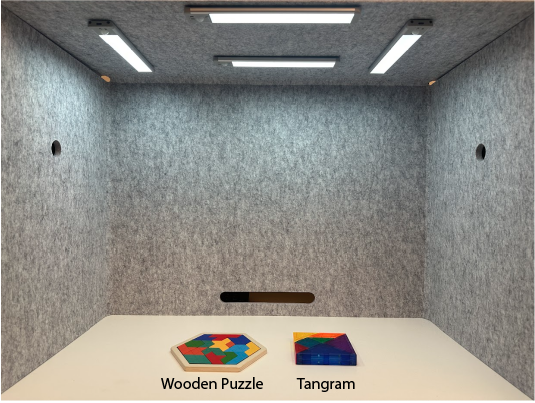
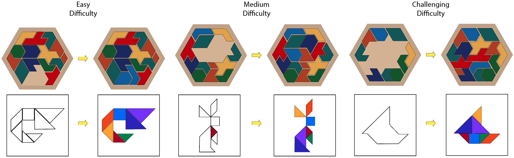
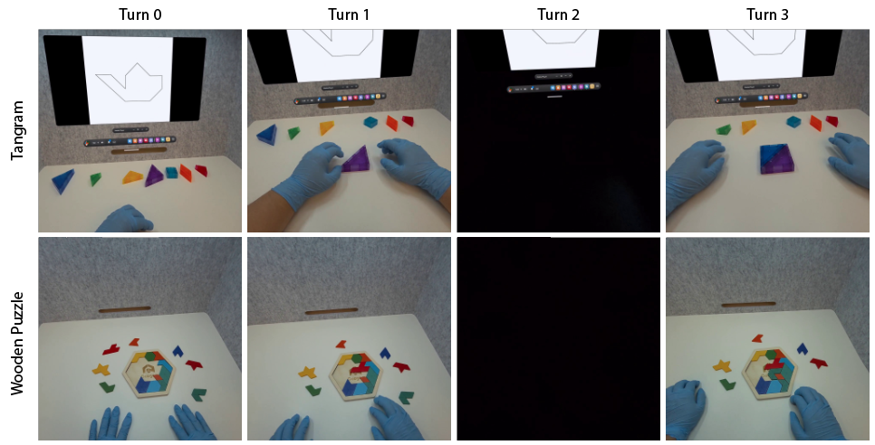

# Spatial Amsan

### A Benchmark for Perception-Grounded Spatial Reasoning and Action Evaluation in Egocentric Manipulation

[](./LICENSE)
[](#repository-layout)
[](#benchmark-at-a-glance)
[](#benchmark-at-a-glance)

**Spatial Amsan** is a benchmark for evaluating *state-based spatial reasoning* and *action assessment* in egocentric manipulation videos. The term *amsan* (Korean for **mental arithmetic**) reflects the core challenge: constructing and continuously updating an internal spatial state to judge whether each manipulation advances toward a goal.

The benchmark comprises two block-manipulation tasks of increasing complexity — a **Tangram** task (7 colored blocks) and a **Wooden Puzzle** task (16 blocks) — yielding **282 scenarios** and **1,801 evaluation turns**. Models are evaluated through a multi-turn protocol that diagnostically isolates four capabilities: **visual perception**, **temporal state tracking**, **spatial contact reasoning**, and **goal-directed action evaluation**, with a conditional follow-up probing **reversibility reasoning**.

> If you use this benchmark, please **cite our paper** (see [Citation](#citation)). The data and annotations are released under the **Apache-2.0** license.

---

## Capture Setup

Egocentric video is captured in a controlled environment with both puzzles on a shared workspace.

<p align="center">
  
</p>

---

## The Two Tasks

### Task 1 — Tangram (7 colored blocks)

A 2D task: blocks cannot be stacked vertically but may be flipped in any orientation. Scenarios span **Easy → Medium → Challenging** difficulty, and additionally introduce **occlusion** conditions to test spatial-state maintenance under missing visual information. The figure below shows goal states (top) with their abstract silhouette targets (bottom).

<p align="center">
  
</p>

### Task 2 — Wooden Puzzle (16 blocks, B1–B16)

A harder packing task with 16 distinct blocks. Some blocks may already be correctly placed; the rest must be manipulated into place. Blocks may be flipped, temporarily occluded, or disappear due to manipulation mistakes.

### Multi-turn manipulation protocol

For each scenario, the model observes the goal state and then a sequence of per-turn frames. At every turn **exactly one manipulation** has occurred relative to the previous turn, and the model answers a fixed battery of questions (Q1–Q4).

<p align="center">
  
</p>

| Question | Capability probed | Type |
|----------|-------------------|------|
| **Q1. Manipulated Block** | Visual perception | single-choice |
| **Q2. Previously Manipulated Block** | Temporal state tracking | single-choice |
| **Q3. Contact Blocks** | Fine-grained spatial contact reasoning | multi-choice |
| **Q4. Manipulation Evaluation** | Goal-directed action evaluation (error taxonomy) | multi-choice |
| **Q4-1. Reasoning** | Explanation for Q4 | free text |
| **Q4-2. Undo Feasibility** | Reversibility reasoning (conditional) | binary |
| **Q4-2-1. Reasoning** | Explanation for Q4-2 | free text |

---

## Benchmark at a Glance

| | Tangram | Wooden Puzzle | Total |
|---|--------:|--------------:|------:|
| Blocks | 7 (colored) | 16 (B1–B16) | — |
| Scenarios | 150 | 132 | **282** |
| Evaluation turns | — | — | **1,801** |
| Modality | egocentric, monocular frames | egocentric, monocular frames | — |

---

## Results

We evaluate nine VLMs zero-shot — three hosted-API models (GPT-5.2, Gemini 3 Flash, Claude Sonnet 4.6) and six open-weight local models. The full analysis is in the paper; the headline results are below.

**Key findings**

- **Spatial contact reasoning (Q3) is the universal bottleneck.** No local model exceeds 28% on Q3 on either task, and every API model collapses to 12–16% on the 16-block Wooden Puzzle despite strong block identification.
- **Action evaluation degrades over time while perception stays stable.** On Task 1, API Q4 accuracy falls from ~80% at Turn 1 to ≤16% by Turn 8, even though Q1 stays above 80% throughout — a dissociation between *seeing* and *reasoning*.
- **Large API–local gap.** The best local model trails the best API model by ~49% (Task 1) and ~25% (Task 2) in overall accuracy.

### Per-question accuracy (%)

Q2 is excluded from Turn 1; Q4-2 is scored only on turns with error ground truth. Best per column in **bold**.

**Task 1: Tangram (7 blocks, 2D)**

| Model | Type | Q1 | Q2 | Q3 | Q4 | Q4-2 | Overall |
|-------|:----:|:--:|:--:|:--:|:--:|:----:|:-------:|
| GPT-5.2 | API | 94.8 | 89.7 | **74.9** | **50.5** | 63.6 | **77.0** |
| Gemini 3 Flash | API | **95.6** | **92.7** | 69.5 | 42.2 | 68.2 | 74.3 |
| Claude Sonnet 4.6 | API | 86.8 | 83.8 | 49.7 | 29.9 | 71.4 | 62.0 |
| Qwen3-VL-8B | Local | 39.2 | 14.5 | 27.9 | 18.2 | 22.4 | 24.1 |
| InternVL3-8B | Local | 34.5 | 24.5 | 5.2 | 15.6 | 20.7 | 15.4 |
| Qwen2.5-VL-7B | Local | 30.5 | 15.4 | 13.3 | 0.6 | **78.6** | 14.1 |
| VideoChat-R1-7B | Local | 33.2 | 21.8 | 6.8 | 0.4 | 40.0 | 10.9 |
| InternVL3.5-8B | Local | 20.6 | 9.4 | 8.6 | 3.3 | 28.9 | 9.2 |
| LLaVA-OV-7B | Local | 19.1 | 19.9 | 0.0 | 0.0 | 61.4 | 7.3 |

**Task 2: Wooden Puzzle (16 blocks)**

| Model | Type | Q1 | Q2 | Q3 | Q4 | Q4-2 | Overall |
|-------|:----:|:--:|:--:|:--:|:--:|:----:|:-------:|
| Claude Sonnet 4.6 | API | **65.6** | **56.3** | 13.6 | 36.1 | 63.0 | **42.8** |
| GPT-5.2 | API | 58.7 | 49.6 | **15.9** | 34.4 | 47.1 | 39.3 |
| Gemini 3 Flash | API | 52.9 | 45.1 | 12.2 | 28.6 | 56.9 | 34.7 |
| InternVL3-8B | Local | 6.1 | 7.6 | 1.3 | **41.9** | **65.6** | 17.5 |
| Qwen3-VL-8B | Local | 13.5 | 1.1 | 0.1 | 22.1 | 58.2 | 11.1 |
| LLaVA-OV-7B | Local | 6.1 | 7.9 | 0.0 | 0.0 | 65.6 | 6.9 |
| VideoChat-R1-7B | Local | 9.2 | 1.1 | 5.3 | 4.6 | 33.8 | 6.8 |
| InternVL3.5-8B | Local | 4.0 | 0.9 | 0.4 | 10.7 | 63.0 | 5.8 |
| Qwen2.5-VL-7B | Local | 10.7 | 0.7 | 0.1 | 1.9 | 42.9 | 5.0 |

### Temporal degradation (Task 1, API models)

Q1 (perception) stays stable across turns while Q4 (action evaluation) collapses — the benchmark's central finding.

| Model | Q | T1 | T2 | T3 | T4 | T5 | T6 | T7 | T8 |
|-------|---|:--:|:--:|:--:|:--:|:--:|:--:|:--:|:--:|
| GPT-5.2 | Q1 | 90.7 | 94.0 | 92.0 | 100.0 | 97.3 | 96.7 | 95.3 | 90.8 |
| GPT-5.2 | Q4 | 81.3 | 79.3 | 58.0 | 56.0 | 47.3 | 36.0 | 19.3 | 3.9 |
| Gemini 3 Flash | Q1 | 93.3 | 94.7 | 94.7 | 99.3 | 96.7 | 96.0 | 94.0 | 96.1 |
| Gemini 3 Flash | Q4 | 81.3 | 66.0 | 43.3 | 40.7 | 33.3 | 28.0 | 16.0 | 15.8 |
| Claude Sonnet 4.6 | Q1 | 89.3 | 85.3 | 81.3 | 92.0 | 89.3 | 84.0 | 89.3 | 80.3 |
| Claude Sonnet 4.6 | Q4 | 79.3 | 35.3 | 28.7 | 22.7 | 24.0 | 20.7 | 8.7 | 10.5 |

---

## Repository Layout

```
SpatialAmsan/
├── problems/
│   ├── tangram.json                 # Task 1 problem spec: setup, options, Q1–Q4 schema
│   ├── wooden_puzzle.json           # Task 2 problem spec
│   └── problem_images/
│       ├── tangram/                 # Task1-pNN.png (+ -ans.png answer keys)
│       └── wooden_puzzle/           # Task2-pNN.png
├── frames/
│   ├── Tangram_mono/
│   │   ├── blocks.jpg               # reference image of the 7 blocks
│   │   ├── _frame_indices.json      # source-video frame indices per scenario
│   │   └── pNN_sMM/                 # per-scenario frames: <scenario>_subK.jpg
│   └── WoodenPuzzle_mono/
│       ├── blocks.jpg               # reference image of the 16 blocks
│       ├── _frame_indices.json
│       └── pNN_sMM/
├── task1_eval/                      # Tangram evaluation engines
│   ├── apis/evaluate_task1.py       #   hosted API models (OpenAI/Claude/Gemini)
│   └── local/evaluate_local_task1.py#   local open-weight models (transformers)
├── task2_eval/                      # Wooden Puzzle evaluation engines
│   ├── apis/evaluate_task2.py
│   └── local/evaluate_local_task2.py
├── scripts/                         # launchers & helpers
│   ├── load_env.sh                  #   loads API keys from .env
│   ├── run_task{1,2}_{api,local}.sh #   run a task against API / local models
│   ├── verify_task{1,2}_{api,local}_sample.sh  # quick smoke tests
│   └── merge_shards.py              #   merge sharded result files
├── requirements.txt
├── .env.example                     # API-key template (copy to .env)
├── assets/                          # figures used in this README
└── LICENSE
```

### Data conventions

- **Scenario id** `pNN_sMM` — `p` = problem (goal configuration), `s` = scenario/sequence.
- **Frames** are named `<scenario>_subK.jpg`. **`sub01` is always the goal state**; subsequent `subK` are the per-turn observations.
- **`blocks.jpg`** in each task folder is the canonical reference image of all blocks, referenced by the problem JSON (`question_header.blocks_reference_image`).

---

## Problem-Set Format

> The problem sets (`problems/tangram.json`, `problems/wooden_puzzle.json`) are **pure, standard JSON** — strictly parseable, with **no comments or trailing commas**. The format is documented here in the README rather than inline in the files.

Each file has the following top-level keys:

| Key | Description |
|-----|-------------|
| `dataset_name` | e.g. `"SpatialAmsan-Tangram"` |
| `version` | dataset version string (e.g. `"v1"`) |
| `task` | human-readable task name |
| `question_header` | shared problem setup, the block reference image, and the answer-option lists (`block_options`, `q1_options`, … `q4_options`) |
| `questions` | the question schema `q1`–`q4_2_1` (prompt text, answer `type`, and which option list each uses) |
| `paths` | `{ "frames_dir": "./frames/<Task>_mono" }` |
| `problems` | array of scenarios (150 for Tangram, 132 for Wooden Puzzle) |

Each entry in `problems` is one scenario:

```jsonc
{
  "problem_id": "tangram_p01_s01",
  "scenario":   "p01_s01",
  "goal_image": "./frames/Tangram_mono/p01_s01/p01_s01_sub01.jpg",
  "blocks_reference": "./frames/Tangram_mono/blocks.jpg",
  "num_turns": 7,
  "turns": [
    {
      "turn": 1,
      "image": "./frames/Tangram_mono/p01_s01/p01_s01_sub02.jpg",
      "q1": 7,          // single-choice: option id (see q1_options)
      "q2": null,       // single-choice or null (no prior manipulation)
      "q3": [8],        // multi-choice: list of option ids
      "q4": [2],        // multi-choice: error-taxonomy option ids
      "q4_1": "",       // free-text rationale for q4
      "q4_2": null,     // binary undo-feasibility (conditional), else null
      "q4_2_1": ""      // free-text rationale for q4_2
    }
    // ... one object per turn, up to num_turns
  ]
}
```

**Answer encoding.** `q1`/`q2` are integer option ids; `q3`/`q4` are lists of integer option ids; `q4_2` is a binary (`"Yes"`/`"No"`) gated on `q4`; the `q*_1`/`q*_2_1` fields are free-text rationales. Resolve every id against the matching `*_options` list in `question_header` (the option text is the ground truth label). Image paths are repo-root-relative.

> Note: the `// ...` markers above are explanatory only — the actual `.json` files contain no comments.

---

## Evaluation Setup & API Keys

> The benchmark **data** (`frames/`, `problems/`) needs no keys. API keys are only required to run the **hosted-API evaluation** (`*_api.sh`); local open-weight models run without any key.

Provide keys via a local `.env` file at the repo root — **never commit real keys**. A template is provided:

```bash
cp .env.example .env      # then edit .env and paste your keys
```

`.env`:

```bash
OPENAI_API_KEY=sk-...          # OpenAI (GPT family)
ANTHROPIC_API_KEY=sk-ant-...   # Anthropic (Claude family)
GOOGLE_API_KEY=...             # Google (Gemini family)
```

Security notes:

- **`.env` is git-ignored** in this repo, so your keys are never staged. Verify with `git status` before committing.
- Prefer exporting keys in your shell session or a secret manager over hard-coding them in any script.
- If a key is ever committed by accident, **revoke and rotate it immediately** — rewriting git history does not un-leak a pushed secret.
- Only the providers you intend to evaluate need a key; leave the others unset.

---

## Running the Evaluation

### 1. Install dependencies

```bash
pip install -r requirements.txt
```

If you only run hosted API models you can skip the local (`torch`/`transformers`) block in `requirements.txt`, and vice versa.

### 2. Run from the repository root

All scripts use repo-relative paths and must be launched from the repo root. Results are written to `./results/`.

#### Hosted API models (OpenAI / Claude / Gemini)

Requires a configured `.env` (see [above](#evaluation-setup--api-keys)). The launchers run all three API models in sequence:

```bash
./scripts/run_task1_api.sh        # Task 1 (Tangram)
./scripts/run_task2_api.sh        # Task 2 (Wooden Puzzle)
```

Override the model ids per provider with environment variables:

```bash
OPENAI_MODEL=gpt-5.2 \
CLAUDE_MODEL=claude-sonnet-4-6 \
GEMINI_MODEL=gemini-3-flash-preview \
  ./scripts/run_task1_api.sh
```

Run a **single** API model, or only a slice of scenarios, by calling the engine directly:

```bash
# Claude only, Task 1, scenarios 0–4 (the --end bound is exclusive)
python task1_eval/apis/evaluate_task1.py \
  --api claude \
  --problems ./problems/tangram.json \
  --frames_dir ./frames \
  --output ./results/task1_claude.json \
  --claude_model claude-sonnet-4-6 \
  --start 0 --end 5 \
  --max_new_tokens 2048 \
  --delay 0.5
```

#### Local open-weight models (no API key needed)

The launchers default to three models — Qwen2.5-VL-7B, InternVL3-8B, and LLaVA-OneVision-7B:

```bash
./scripts/run_task1_local.sh      # Task 1, all default local models
./scripts/run_task2_local.sh      # Task 2
```

Select specific models with `MODELS` (comma-separated):

```bash
MODELS="qwen2p5_vl_7b" ./scripts/run_task1_local.sh                  # single model
MODELS="qwen2p5_vl_7b,internvl3_8b_hf" ./scripts/run_task2_local.sh  # subset
```

Available model ids: `qwen2p5_vl_7b`, `internvl3_8b_hf`, `llava_onevision_qwen2_7b_ov_hf`. The large `llama4_scout_17b16e` is excluded by default (very slow); enable it with `MODELS="all"` or `./scripts/run_task1_local.sh --llama4-only`.

Call the engine directly for full control over device and precision:

```bash
python task1_eval/local/evaluate_local_task1.py \
  --problems ./problems/tangram.json \
  --frames_dir ./frames \
  --output_dir ./results/local \
  --models qwen2p5_vl_7b \
  --start 0 --end 5 \
  --max_new_tokens 512 \
  --device_map auto \
  --dtype bf16
```

### 3. Smoke-test before a full run

Each verify script runs a single scenario and prints per-turn scores side by side — a fast way to confirm keys, model ids, and GPU setup:

```bash
./scripts/verify_task1_api_sample.sh                  # 1 scenario, all 3 API models
SAMPLE_IDX=3 ./scripts/verify_task1_local_sample.sh   # pick a scenario, local models
MODELS="qwen2p5_vl_7b" ./scripts/verify_task2_local_sample.sh
```

### Environment overrides

| Variable | Applies to | Default | Purpose |
|----------|------------|---------|---------|
| `PROBLEMS` | all | `./problems/<task>.json` | problem-set file |
| `FRAMES_DIR` | all | `./frames` | frames root |
| `START` / `END` | all | `0` / end | evaluate a scenario slice (`END` exclusive; used for sharding) |
| `MAX_TOKENS` | all | 2048 (API) / 512 (local) | max new tokens per turn |
| `DELAY` | API | `0.5` | seconds between API calls (rate-limit safety) |
| `MODELS` | local | all except llama4 | comma-separated local model ids |
| `DEVICE_MAP` / `DTYPE` | local | `auto` / `bf16` | device placement and precision |
| `OPENAI_MODEL` / `CLAUDE_MODEL` / `GEMINI_MODEL` | API | paper defaults | override API model ids |
| `SAMPLE_IDX` | verify | `0` | which scenario the smoke test runs |

### Output

Each engine writes per-model JSON to `./results/` containing every turn's parsed model answer, the ground truth, and per-question correctness for scoring. Sharded runs (split via `START`/`END`) can be recombined with `scripts/merge_shards.py`.

---

## Original (Raw) Video Data

The `frames/` here are sampled from the original recordings. We additionally release the **source videos (minimum-cut)** for both monocular and stereo captures:

| Task | Monocular | Stereo |
|------|-----------|--------|
| **Tangram** | [Google Drive](https://drive.google.com/drive/folders/1B-K7ku5ZI4BZEhoU6ZbPIsfm3Q5j__Ki?usp=sharing) | [Google Drive](https://drive.google.com/drive/folders/1vpOE275ZEaWWW-bEsqjoonssJ2CV5jvU?usp=sharing) |
| **Wooden Puzzle** | [Google Drive](https://drive.google.com/drive/folders/11PVOPmSFzzuQPjOjQbt8s46On9690o5n?usp=sharing) | [Google Drive](https://drive.google.com/drive/folders/1xR6xd2-ihnR9xhDkodEIGzgfTNdYoGA3?usp=sharing) |

> Each linked video contains the minimum cut only.

---

## Citation

If you use Spatial Amsan in your research, please cite:

```bibtex
@inproceedings{spatialamsan2026,
  title     = {Spatial Amsan: A Benchmark for Perception-Grounded Spatial
               Reasoning and Action Evaluation in Egocentric Manipulation},
  author    = {Anonymous},
  booktitle = {European Conference on Computer Vision (ECCV)},
  year      = {2026}
}
```

> Author and venue details will be finalized upon publication.

---

## License

This benchmark — data, annotations, and accompanying materials — is released under the
[Apache License 2.0](./LICENSE). You are free to use, modify, and distribute it,
including for commercial purposes, provided you retain attribution and **cite our paper**.
